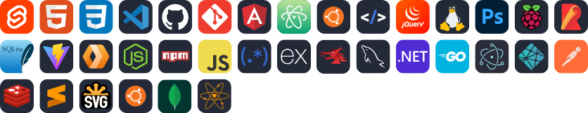

### Developer, photographer, nature enthusiast and entrepeneur from Rio de Janeiro, Brazil.

  

<h2 align="center">Tools of my trade</h2>
 

    <!-- https://skillicons.dev/icons?theme=dark&i=svelte,html,css,vscode,github,git,angular,atom,ubuntu,htmx,jquery,linux,ps,raspberrypi,rollupjs,sqlite,vite,workers,nodejs,npm,javascript,regex,express,mongodb,mysql,dotnet,go,electron,netlify,postman,redis,sublime,svg,ubuntu -->
    

  

<h2 align="center">Stats</h2>
 

  
     
  
   
  

<!--
**wstaeblein/wstaeblein** is a ✨ _special_ ✨ repository because its `README.md` (this file) appears on your GitHub profile.

Here are some ideas to get you started:

- 🔭 I’m currently working on ...
- 🌱 I’m currently learning ...
- 👯 I’m looking to collaborate on ...
- 🤔 I’m looking for help with ...
- 💬 Ask me about ...
- 📫 How to reach me: ...
- 😄 Pronouns: ...
- ⚡ Fun fact: ...
-->
